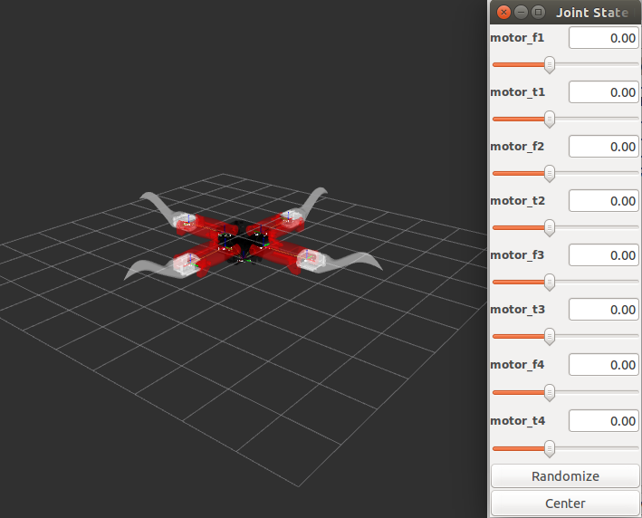
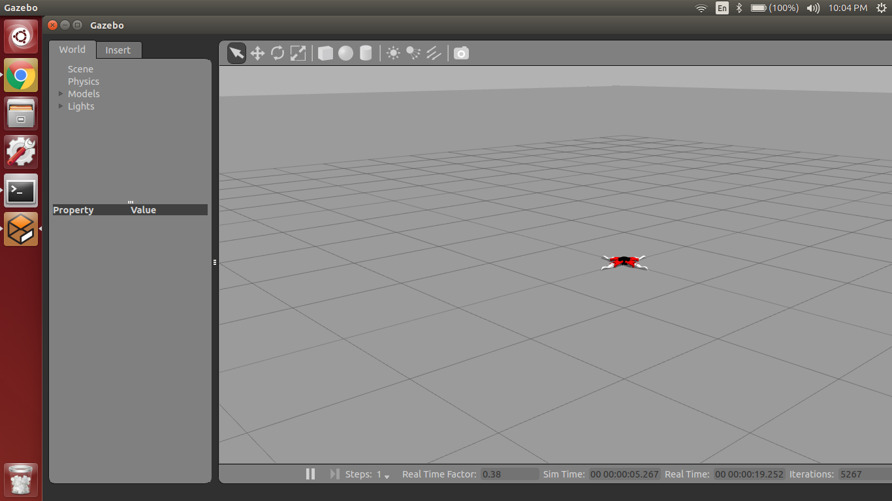

# Spyndra-ROS-Simulator
This project provides a simulation environment in ROS to mimic the open-source robotic platform [Spyndra](http://www.creativemachineslab.com/spyndra.html).

## Installation
This project assumes using [ROS Indigo](http://wiki.ros.org/indigo/Installation) and Ubuntu 14.04 LTS.

1. Suppose you have not create your ROS workspace. You can create one by the command.

   ```
   $ mkdir -p ~/catkin_ws/src
   ```

2. Go to the workspace and download the repository.

   ```
   $ cd ~/catkin_ws/src
   $ git clone https://github.com/roboticistYan/Spyndra-ROS-Simulation
   ```

3. Make sure you have ros_control packages

   ```
   $ sudo apt-get install ros-indigo-ros-control ros-indigo-ros-controllers
   $ sudo apt-get install ros-indigo-gazebo-ros-control ros-indigo-effort-controllers ros-indigo-joint-state-controller ros-indigo-joint-trajectory-controller
   ```

3. Check ROS dependencies

   ```
   $ rosdep update
   $ rosdep check --from-paths src --ignore-src --rosdistro indigo
   ```
   
   If any dependency is missing, you can auto-install them by the command
   
   ```
   $ cd ~/catkin_ws
   $ rosdep install --from-paths src --ignore-src --rosdistro indigo -y
   ```


5. Build the source code.

   ```
   $ cd ~/catkin_ws
   $ catkin_make
   ```
        
6. To verify installation, launch the following command.

   ```
   $ source ~/catkin_ws/devel/setup.bash
   $ roslaunch spyndra_description display.launch
   ```

   If you see things similar to the screenshot below, you are all set for this project.
   
   
   
## Running Simulation

1. First, invode the Spyndra model in gazebo

   ```
   $ roslaunch spyndra_gazebo spyndra.launch
   ```
   
   This command should bring up gazebo interface like this:
   
   

2. Now we need to invoke the controller

   ```
   $ roslanch spyndra_control spyndra_control.launch
   ```
   
3. In order to check if the controller is successfully launched, issue the command
   
   ```
   $ rostopic list
   ```
   
   If you see the output below, you are ready to generate angle commands.

   ```
   /clock
   /gazebo/link_states
   /gazebo/model_states
   /gazebo/parameter_descriptions
   /gazebo/parameter_updates
   /gazebo/set_link_state
   /gazebo/set_model_state
   /imu
   /rosout
   /rosout_agg
   /spyndra/joint1_position_controller/command
   /spyndra/joint1_position_controller/pid/parameter_descriptions
   /spyndra/joint1_position_controller/pid/parameter_updates
   /spyndra/joint1_position_controller/state
   /spyndra/joint2_position_controller/command
   /spyndra/joint2_position_controller/pid/parameter_descriptions
   /spyndra/joint2_position_controller/pid/parameter_updates
   /spyndra/joint2_position_controller/state
   /spyndra/joint3_position_controller/command
   /spyndra/joint3_position_controller/pid/parameter_descriptions
   /spyndra/joint3_position_controller/pid/parameter_updates
   /spyndra/joint3_position_controller/state
   /spyndra/joint4_position_controller/command
   /spyndra/joint4_position_controller/pid/parameter_descriptions
   /spyndra/joint4_position_controller/pid/parameter_updates
   /spyndra/joint4_position_controller/state
   /spyndra/joint5_position_controller/command
   /spyndra/joint5_position_controller/pid/parameter_descriptions
   /spyndra/joint5_position_controller/pid/parameter_updates
   /spyndra/joint5_position_controller/state
   /spyndra/joint6_position_controller/command
   /spyndra/joint6_position_controller/pid/parameter_descriptions
   /spyndra/joint6_position_controller/pid/parameter_updates
   /spyndra/joint6_position_controller/state
   /spyndra/joint7_position_controller/command
   /spyndra/joint7_position_controller/pid/parameter_descriptions
   /spyndra/joint7_position_controller/pid/parameter_updates
   /spyndra/joint7_position_controller/state
   /spyndra/joint8_position_controller/command
   /spyndra/joint8_position_controller/pid/parameter_descriptions
   /spyndra/joint8_position_controller/pid/parameter_updates
   /spyndra/joint8_position_controller/state
   /spyndra/joint_states
   /tf
   /tf_static
   ```
4. After confirming the rostopic, you can test the simple harmonic walk (sine wave with phase lag)

   ```
   $ rosrun spyndra_ros_simulation sine_walk
   ```

## License
This work is licensed under [MIT License](https://opensource.org/licenses/MIT).
