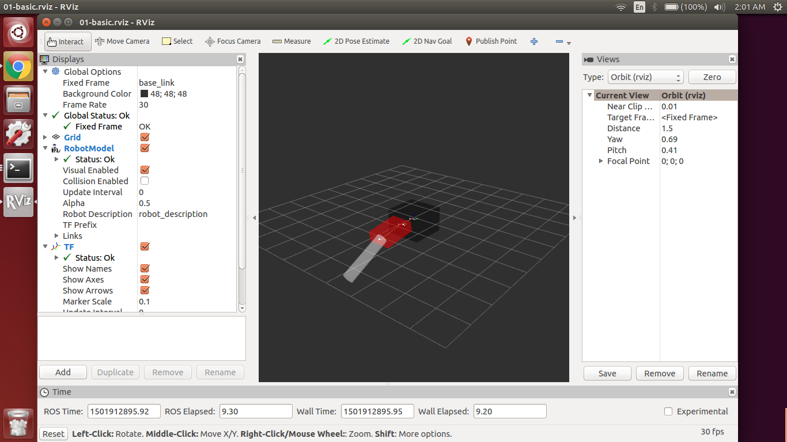

# Spyndra-ROS-Simulator
This project provides a simulation environment in ROS to mimic the open-source robotic platform [Spyndra](http://www.creativemachineslab.com/spyndra.html).

## Installation
This project assumes using [ROS Indigo](http://wiki.ros.org/indigo/Installation) and Ubuntu 14.04 LTS.

1. Suppose you have not create your ROS workspace. You can create one by the command.

   ```
   $ mkidr -p ~/catkin_ws/src
   ```

2. Go to the workspace and download the repository.

   ```
   $ cd ~/catkin_ws/src
   $ git clone https://github.com/roboticistYan/Spyndra-ROS-Simulation
   ```

3. Build the source code.

   ```
   $ cd ~/catkin_ws
   $ catkin_make
   ```
        
4. To verify installation, launch the following command.

   ```
   $ source ~/catkin_ws/devel/setup.bash
   $ roslaunch spyndra_ros_simulator 01-basicmove.launch
   ```

   If you see things similar to the screenshot below, you are all set for this project.
   
   
   

## License
This work is licensed under [MIT License](https://opensource.org/licenses/MIT).
